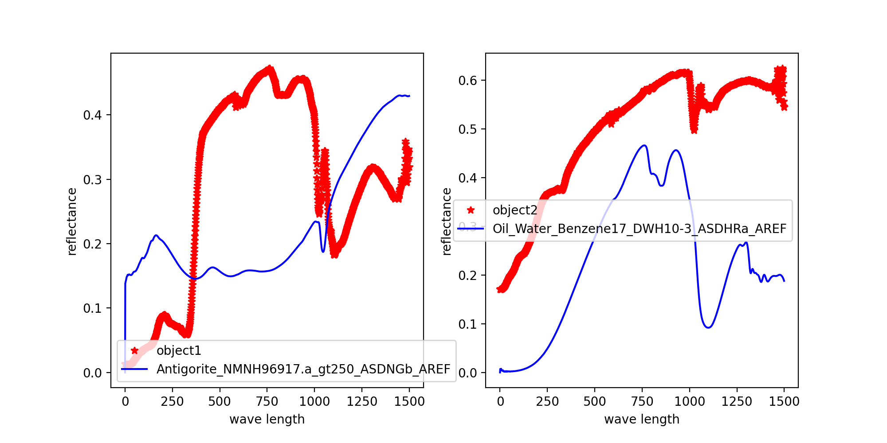

## ESE5032: Environment Remote Sensing Graduate Course

Graduate class at Southern University of Science and Technology(SUSTech), from the syllabus:

*“The course pays attention to the rule of reciprocity between teaching and studying: topic discussion in class is also the way in our teaching. According to students psychological characteristics, to set up doubt, ask questions r from practical problems. To full use of multimedia technology will help students establish a correct concept of deep understanding of the teaching content. Furthermore, it widens their knowledge, trains their ability to gain knowledge actively and solve problems. It makes the students get a deeper understanding of the theory with case analysis. This course can strengthen the application status of remote sensing technology on resource and ecology survey”*

### Course Objectives:

Students can realize and command the following learning outcomes by learning the course: 

* Understand fundamental physics of remote sensing, principles of remote sensing imaging and image interpretation. 

* Understand remote sensing technological systems and master information extraction from remote sensing images. 

* Apply remote sensing technologies on nature resource, environmental and geographical inventory and analytical study. 

* Understand and master different approaches to interpreting remote sensing images including aerophoto, multispectral image, thermal infrared image, radar image and hyperspectral image

* Understand the development of remote sensing technology. 

* Understand the application of intelligent image interpretation and quantitative remote sensing on nature resource, environmental monitoring, and disaster assessment etc.

### Declaim

This repository contains homework for this class. The Instructor in this class is [Feng Lian](https://faculty.sustech.edu.cn/fengl/). Thanks for his work. This repository will keep updating until the end of this class. 

- [ESE5032: Environment Remote Sensing Graduate Course](#ese5032-environment-remote-sensing-graduate-course)
  - [Course Objectives:](#course-objectives)
  - [Declaim](#declaim)
- [Getting Started](#getting-started)
  - [Dependencies](#dependencies)
- [Update HW1 2022/9/24](#update-hw1-2022924)
    - [The structure of HW1 is:](#the-structure-of-hw1-is)
    - [the matching result in cosine distance:](#the-matching-result-in-cosine-distance)
    - [the matching result in euclidean distance:](#the-matching-result-in-euclidean-distance)
    - [the matching result in mahalanobis distance:](#the-matching-result-in-mahalanobis-distance)
- [Next update is coming soon~](#next-update-is-coming-soon)
- [Help](#help)
- [Authors](#authors)
- [License](#license)
- [Acknowledgments](#acknowledgments)

## Getting Started

### Dependencies

* Python3.x
* numpy, pandas, matplotlib, tqdm


## Update HW1 2022/9/24

#### The structure of HW1 is:

```python
└─hw1# homework1 folder
    │  data_matching.py#main
    │  matched_object_spectral_cosine.png#matched object in cosine distance
    │  matched_object_spectral_euclidean.png#matched object in euclidean distance
    │  matched_object_spectral_mahalanobis.png#matched object in mahalanobis distance
    │  spec_array.npy#numpy array format of all materials' spectrals in USGS spectral lib07
    │  spec_name.npy#numpy array format of all materials' names in USGS spectral lib07
    │  utils.py#some function used in data_matching.py
    │  
    ├─spectral_experiment#three objects measured in the experiment,object3 is the standard whiteboard, object4 is grass, object5 is a road
    │      17B60A4_00003.raw
    │      17B60A4_00003.sed
    │      17B60A4_00004.raw
    │      17B60A4_00004.sed
    │      17B60A4_00005.raw
    │      17B60A4_00005.sed
    │      White_plaque_reference_白板反射率.txt
    │      
    ├─usgs_splib07#USGS spectral lib version7
    │  │  README.htm#some description about the data
    │  │  
    │  └─ASCIIdata_splib07b_cvASD#spectral measured by ASD
    │      │  s07_ASD_Bandpass_(FWHM)_ASDFR_StandardResolution.txt
    │      │  s07_ASD_Wavelengths_ASD_0.35-2.5_microns_2151_ch.txt#wave length
    │      └─all_material#all materials' spectral in text form

    └─__pycache__
            utils.cpython-38.pyc
            
```

#### the matching result in cosine distance:


#### the matching result in euclidean distance: 


#### the matching result in mahalanobis distance:



## Next update is coming soon~


## Help

If anyone has any problem about this repository, it’s welcomed to put forward issues in Github or email me.

## Authors

* Yu bin: 12232254@mail.sustech.edu.cn


## License

This project is licensed under the MIT License - see the LICENSE.md file for details

## Acknowledgments

Here acknowledge the author, i.e. myself, for his time and effort and you for your effort to finish this homework:)

